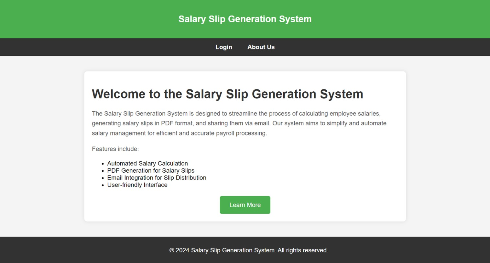
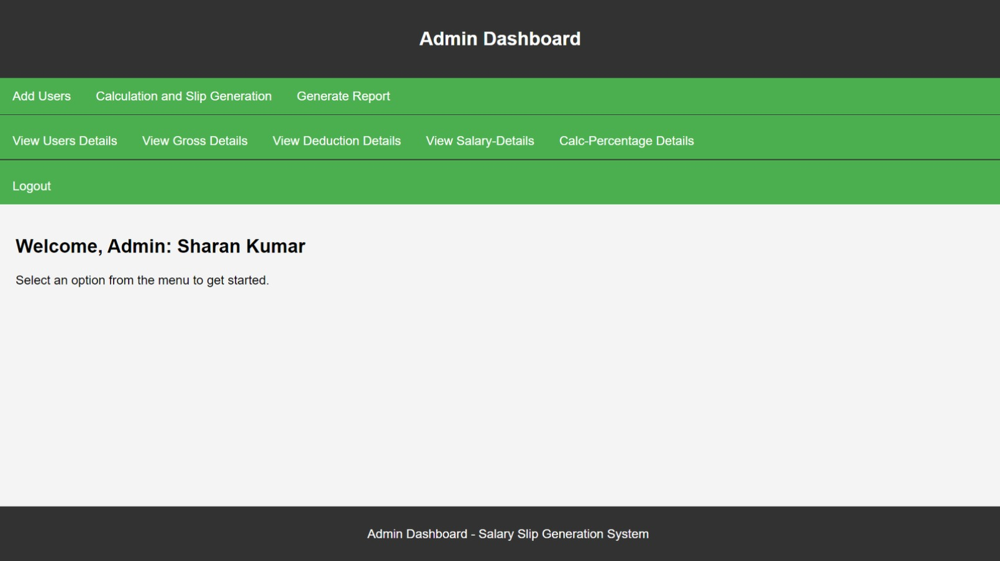
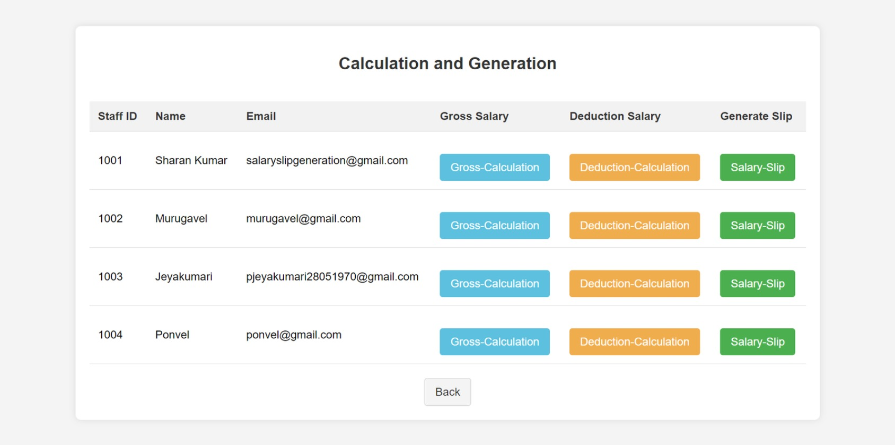
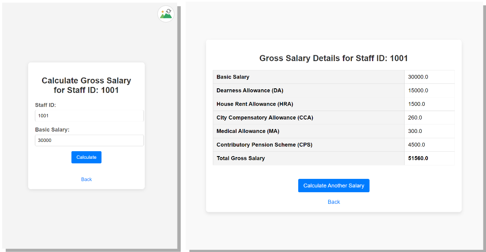
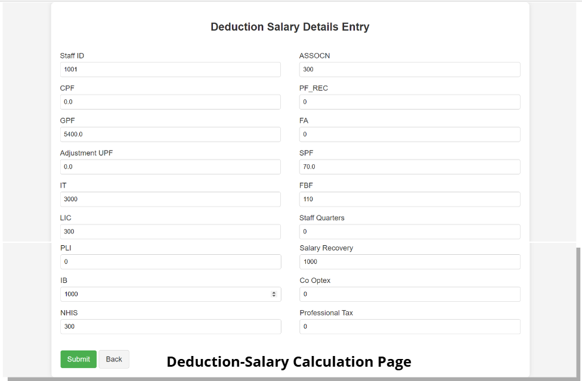
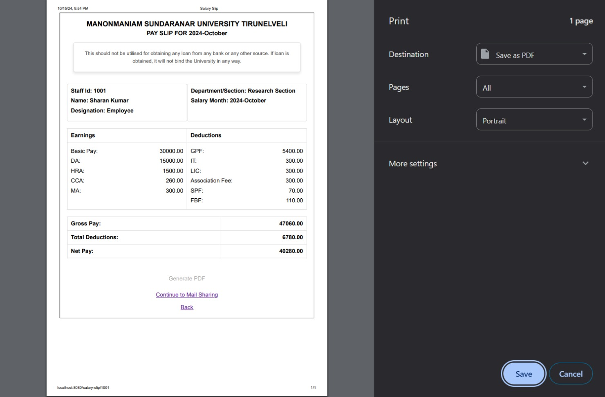
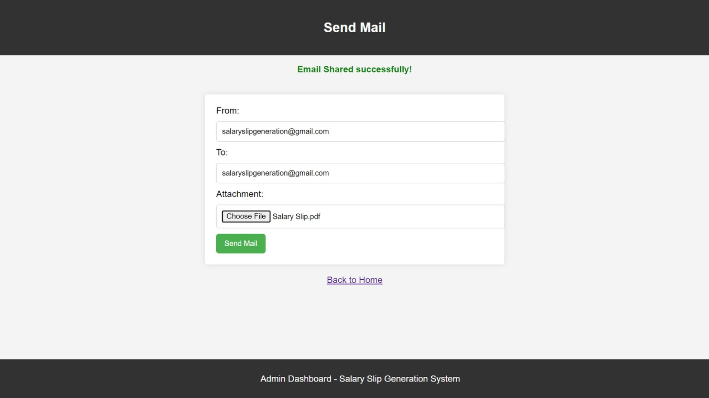
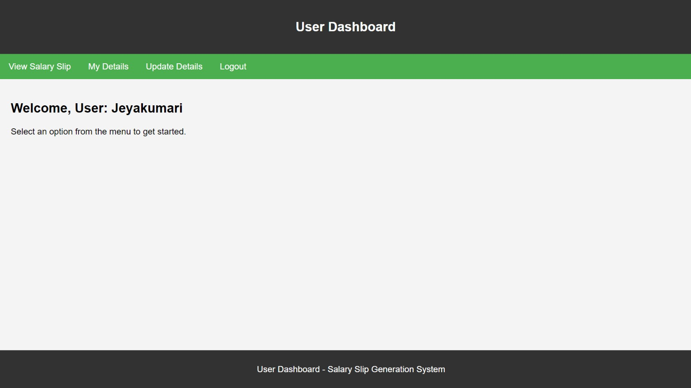

The Salary Slip Generation System is a web application designed to automate and streamline the process of generating and managing salary slips for university staff. This project provides functionalities for both administrators and users, ensuring efficient salary management.

Screenshots:-

Home Page:-

Admin Dashboard: Admins can manage user accounts, calculate salaries, and generate salary slips.

Calculation and Generation: Admins can perform salary calculation and Generate Salary Slip in PDF Format.

Gross-Salary Calculation: Calculates gross salary based on user input.

Deduction-Salary Calculation: Calculates deduction salary based on gross salary.

Salary-Bill Generation: Admin can Generate salary bill for particular employee(Salary bill includes all fields with values of zero and Non-zero).

.jpeg)
.jpeg)

Salary-Slip Generation: (Salary Slip includes only Non-zero values fields).

.jpeg)
.jpeg)

PDF Generation: Generates salary slips in PDF format for easy sharing.

Email Notifications: Sends salary slips to employees via email.

Generate Report: Admin can generate report for particular Department or Section and download it as a PDF file.

.jpeg)
.jpeg)

User Registration and Login: Users can log in to view and download salary slips, view and update their details.

Technologies Used:-

Backend: Java, Spring Boot

Frontend: HTML, CSS

Database: MySQL

Other Tools: Git, GitHub, Maven
