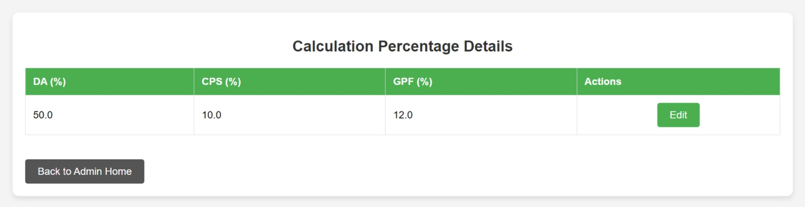
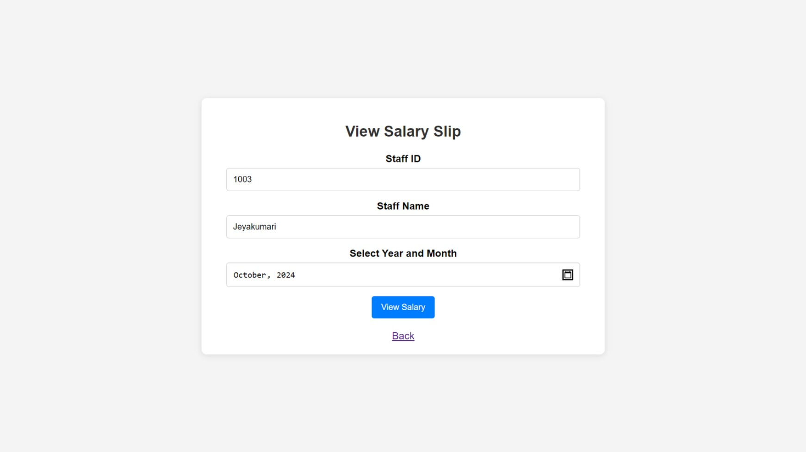
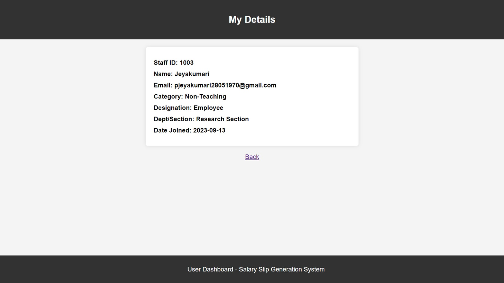
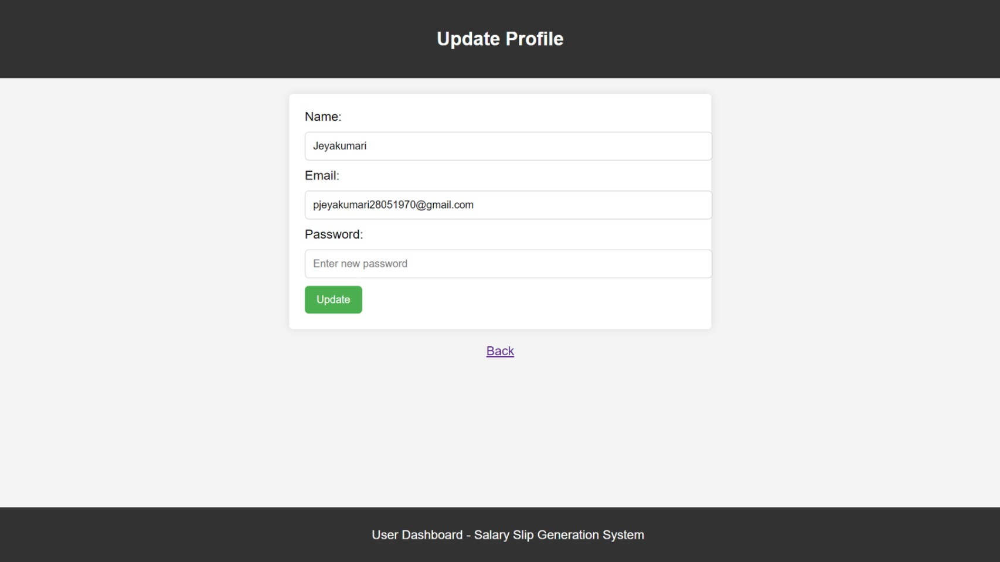

Salary Slip Generation System
The Salary Slip Generation System is a web application developed to automate and streamline the process of generating and managing salary slips for university staff. This system provides a user-friendly interface for both Administrators and Users, ensuring efficient salary management and smooth operation of administrative tasks.

Features
1. Admin Dashboard
Admins have access to a comprehensive dashboard where they can manage user accounts, calculate salaries, and generate salary slips for staff.

2. Salary Calculation and Generation
Admins can easily calculate the salary components (Gross Salary, Deductions) and generate salary slips in PDF format.

3. Gross Salary Calculation
The system allows admins to calculate the gross salary based on user input such as basic pay, allowances, etc.

4. Deduction Salary Calculation
Admins can calculate the deduction salary based on the gross salary, including taxes, insurance, and other deductions.

5. Salary Bill Generation
Admins can generate salary bills for specific employees. These bills include both zero and non-zero fields for clear and transparent salary records.

6. Salary Slip Generation
The system generates detailed salary slips that include only the non-zero values, making them concise and informative.

7. PDF Generation
Once the salary slip is generated, it can be converted to a PDF format for easy sharing and distribution.

8. Email Notifications
Salary slips are automatically sent to employees via email for seamless delivery.

9. Report Generation
Admins can generate detailed reports for specific departments or sections and download them in PDF format.

10. Edit Calculation Percentages
Admins have the ability to modify salary calculation percentages for accurate payroll processing.

11. User Registration and Login
Users can register, log in, and access their salary information. They can view and download their salary slips and update personal details as needed.
Screenshots:-

Home Page:-

Admin Dashboard: Admins can manage user accounts, calculate salaries, and generate salary slips.

Calculation and Generation: Admins can perform salary calculation and Generate Salary Slip in PDF Format.

Gross-Salary Calculation: Calculates gross salary based on user input.

Deduction-Salary Calculation: Calculates deduction salary based on gross salary.

Salary-Bill Generation: Admin can Generate salary bill for particular employee(Salary bill includes all fields with values of zero and Non-zero).

.jpeg)
.jpeg)

Salary-Slip Generation: (Salary Slip includes only Non-zero values fields).

.jpeg)
.jpeg)

PDF Generation: Generates salary slips in PDF format for easy sharing.

Email Notifications: Sends salary slips to employees via email.

Generate Report: Admin can generate report for particular Department or Section and download it as a PDF file.

.jpeg)
.jpeg)

Calculation Percentage: Admin can edit Salary Calculation Percentage.

User Registration and Login: Users can log in to view and download salary slips, view and update their details.

Technologies Used:-

Backend: Java, Spring Boot

Frontend: HTML, CSS

Database: MySQL

IDE: Intellij IDEA
